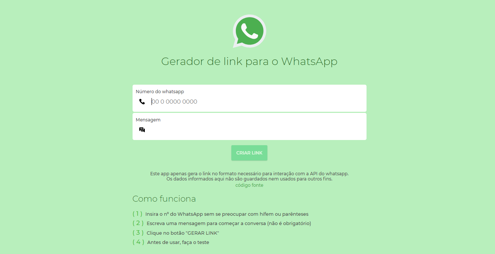
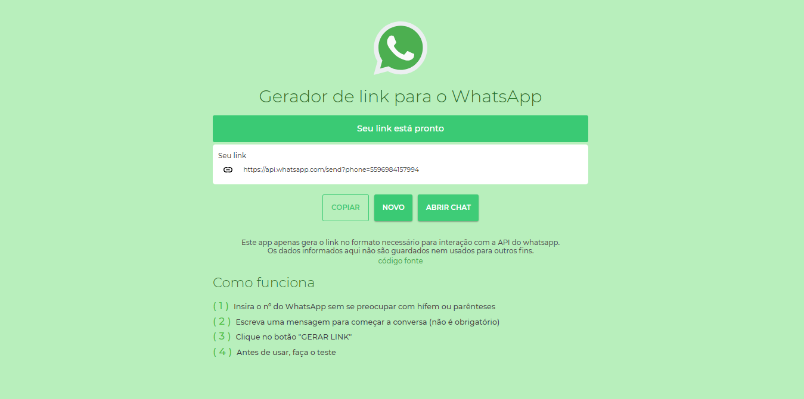
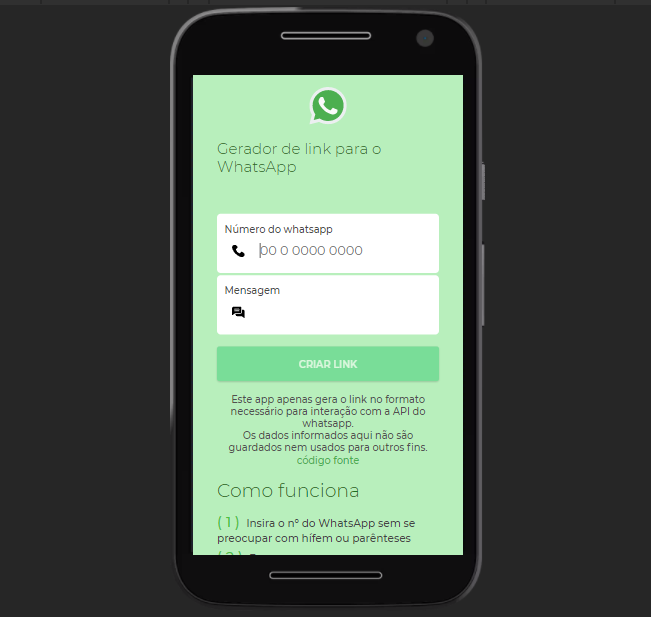

# Gerador de link de conversa no whatsapp

[whatsapp-link-generator.vercel.app](https://whatsapp-link-generator.vercel.app/)

#### Data de criação: 18/11/2020

Geração de links para interação com a API de conversa do WhatsApp.

# Como instalar

Não tem nem isso de "instalar", é só baixar e partir pro abraço. Não tem dependências, são assets estáticos (html, css, js e svg's).

# Preview

### Minhas redes sociais:

[Instagram](https://www.instagram.com/oli7eirafelipe/)

[LinkedIn](https://www.linkedin.com/in/felipeoli7eira/)

[Telegram](https://t.me/felipeOli7eira_t)
