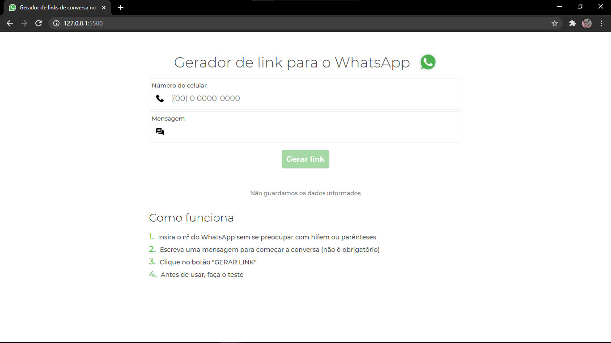
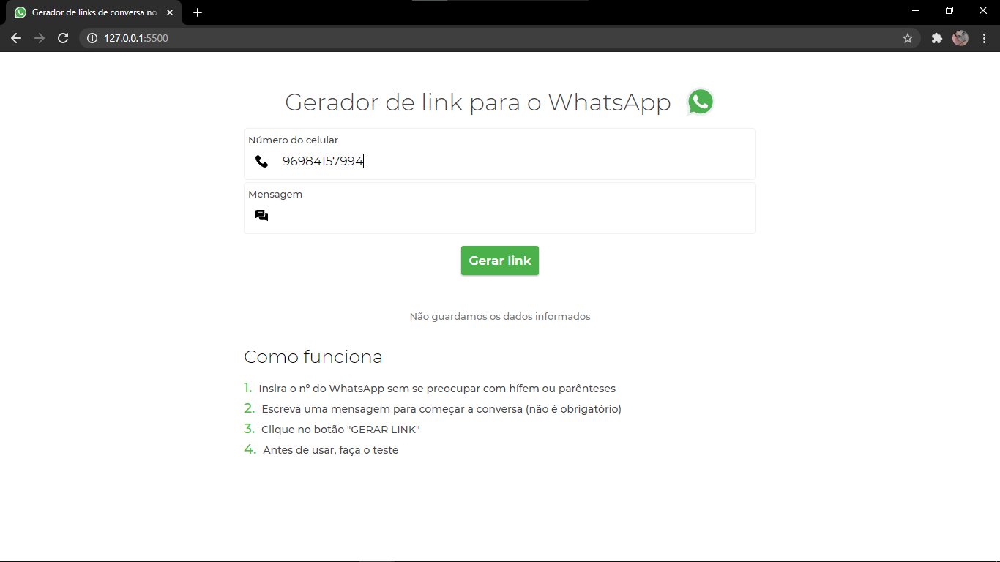
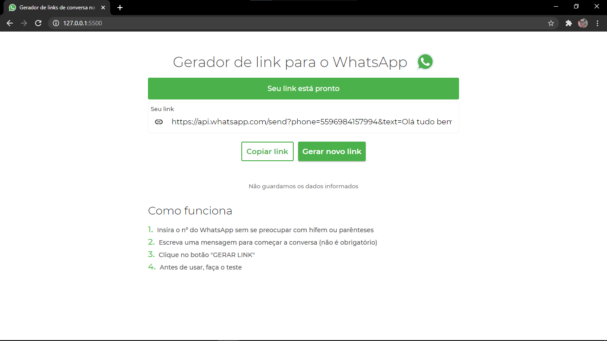

# Gerador de link de conversa no whatsapp
Quase finalizado

#### Data: 18/11/2020

Um belo dia eu estava assistindo uma video-aula de photoshop, aí o instrutor mostrou um site que gera link de conversa no whatsapp (era uma aula de como fazer um cartão digital interativo (link do cartão logo abaixo) ). Eu olhei e falei: "oshi '-', facin  de fazer"... aí eu fiz, só isso mesmo kkkk, pra dar uma praticada.

[O cartão que eu acabei de falar](https://drive.google.com/file/d/1HUQOxFwa_9pkn3VvrkYlpwRtZj_UdABV/view?usp=sharing)

# O Projetinho

A mensagem é opcional

### Minhas redes sociais:

[Instagram](https://www.instagram.com/felipeoli7eira/)
[LinkedIn](https://www.linkedin.com/in/felipeoli7eira/)
[Telegram](https://t.me/felipeOli7eira_t)